# **Credit_Risk_Analysis**

## **Overview**
The purpose of this analysis is to predict credit risk by resampling a given credit card credit dataset from LendingClub using various machine learning algorithms. A comparison is then done using two machine learning models.

## **Results**
Before resampling the data, the *loan_status* column values were split into two categories, *low_risk and high_risk*.  

**Del 1: Resampling Models**

**Naive Random Oversampling**
The RandomOverSampler algorithm was used to resample the data, this randomly selects instances of the minority class and adds them to the training set until *low_risk* and *high_risk* are balanced. 

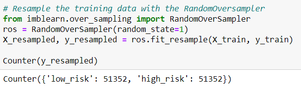

     * Balanced Accuracy Score: 64%
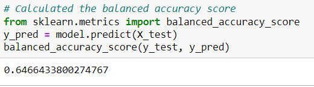

     * Precision Scores
      - High Risk: 0.01 = 1%
      - Low Risk:  1.00 = 100%
     
     * Recall Scores
      - High Risk: 0.65 = 66%
      - Low Risk:  0.65 = 62%

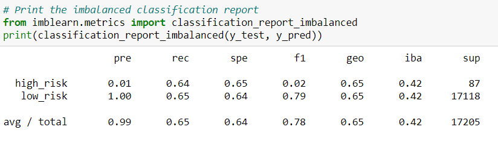

**SMOTE Oversampling**
With SMOTE, the size of the minority class is also increased, except it is done by interpolating new instances.

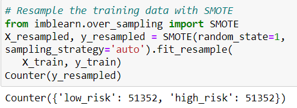

     * Balanced Accuracy Score: 64%
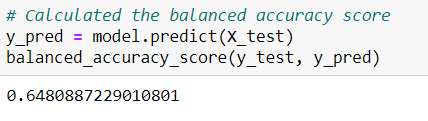
     
     * Precision Scores
      - High Risk: 0.01 = 1%
      - Low Risk:  1.00 = 100%

     * Recall Scores
     - High Risk: 0.62 = 62%
     - Low Risk:  0.68 = 68%

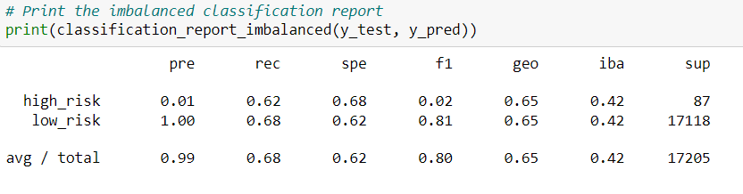

**Cluster Centroids Undersampling**
ClusterCentroids is opposite of oversampling in that it undersamples the majority class to match the minority class. This is done by identifying clusters of the majority and then synthetic clusters are generated.

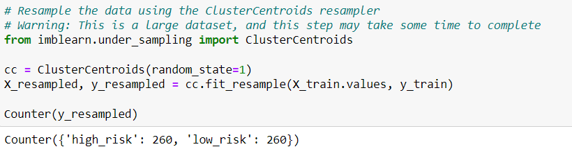

     * Balanced Accuracy Score: 64%

     * Precision Scores
      - High Risk: 0.01 = 1%
      - Low Risk:  1.00 = 100%

     * Recall Scores
      - High Risk: 0.70 = 70%
      - Low Risk:  0.58 = 58%

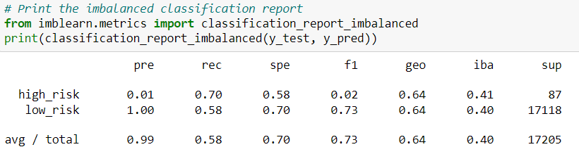

**Del 2: Using SMOTEENN Algorithm**

**Combination(Over and Under) Sampling**
SMOTEENN is a two step process comprised of the SMOTE and EEN(Edited Nearest Neighbors) algorithms. First, the minority class is oversampled. Then, the data is cleaned using an undersampling strategy. If a data point is close to two data points of the different classes, the data point will be dropped. 

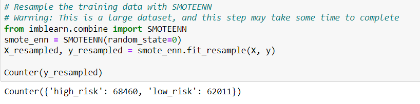

     * Balanced Accuracy Score: 64%
     
     * Precision Scores
      - High Risk: 0.01 = 1%
      - Low Risk:  1.00 = 100%

     * Recall Scores
      - High Risk: 0.70 = 70%
      - Low Risk:  0.58 = 58%

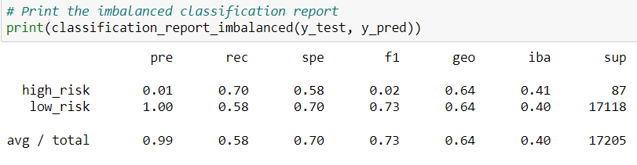

**Del 3: Ensemble Classifiers to Predict Credit Risk**

**Balanced Random Forest Classifier**
BalancedRandomForestClassifier randomly undersamples the dataset when boostraping from the training dataset to balance it.

     * Balanced Accuracy Score: 80%

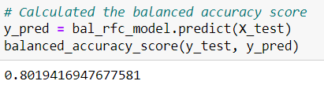

     * Precision Scores
      - High Risk: 0.04 = 4%
      - Low Risk:  1.00 = 100%

     * Recall Scores
      - High Risk: 0.70 = 70%
      - Low Risk:  0.90 = 90%

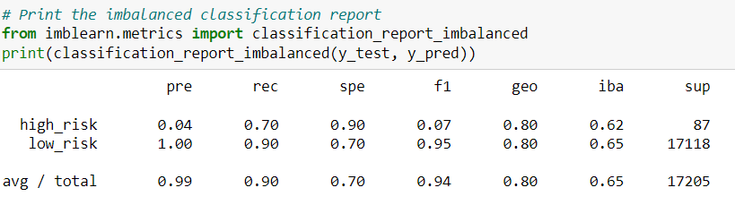

**Easy Ensemble AdaBoost Classifier**
EasyEnsembleClassifier balances the majority and minority class by random undersampling. This is done by an ensemble of adaboost learners trained on different balanced bootstrap samples. 

     * Balanced Accuracy Score: 93%

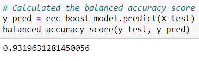

     * Predicted Scores
      - High Risk: 0.08 = 80%
      - Low Risk:  1.00 = 100%

     * Recall Scores
      - High Risk: 0.92 = 92%
      - Low Risk:  0.94 = 94%

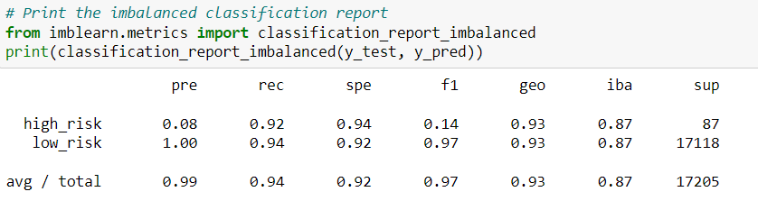

## **Summary**
The first 4 machine algorithms had the same outcome of 1% in their predicted scores for high risk and 100% for low risk. While their recall scores varied, they were between 62% and 70% for high risk. Low risk had the most variation in its recall score, the lowest being 58% which was the clustered centroid algorithm. The highest recall score percentage was 94% from the easy ensemble adaboost classifier. 

**Recommendation**
Easy ensemble ada boost classifier had the best results. The accuracy score is 93% and the high risk category had an 80% predicted score and 92% recall score. Low risk had a 100% predicted score and 94% recall score.
 

 
